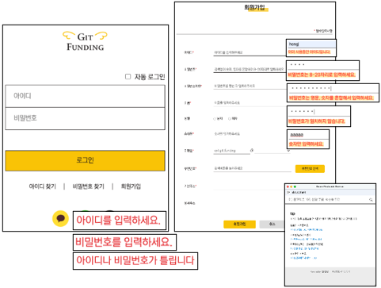
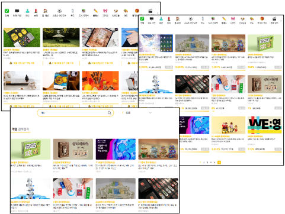

<h1>Git Funding</h1>

기존의 펀딩사이트에 인스타그램 형식의 커뮤니티를 추가한 웹 서비스입니다.

 
<h2>⛏사용기술</h2>
<h3>Frontend</h3>
<ul>
  <li><b>Language</b> : HTML5, CSS3, JavaScript</li>
  <li><b>Library & Framework</b> : Vue3, JQuery</li>
</ul>
<h3>Backend</h3>
<ul>
  <li><b>Language</b> : Java11</li>
  <li><b>Library & Framework</b> : Spring Framework, Spring Security</li>
  <li><b>Database</b> : Oracle21c, ElasticSearch</li>
  <li><b>ORM</b> : MyBatis</li>
</ul>
 
<h2>✨담당 구현</h2>
<ul>
  <li>
    
메인페이지

    
    <ul>
      <li>JQuery - 메인페이지 UI 구현</li>
      <li>Vue - 탭 목록 구현</li>
      <li>MyBatis - 조건에 맞는 목록 출력</li>
      <li>Cookie - 최근 본 목록 출력</li>
    </ul>
  </li>
  <li>
    
로그인/회원가입

    
    <ul>
      <li>Vue, Spring Security - 로그인, 회원가입, PW 암호화</li>
      <li>Daum API - 우편번호 검색</li>
    </ul>
  </li>
  <li>
    
오픈예정/진행중 펀딩목록 출력, 검색

    
    <ul>
      <li>Vue, MyBatis - 알림 설정, 분류별 목록 출력</li>
      <li>Inline View - 페이징</li>
      <li>ElasticSearch - 검색</li>
    </ul>
  </li>
  <li>
    
상세페이지/커뮤니티

    
    <ul>
      <li>Vue - 댓글형 게시판 CRUD, 위시리스트</li>
    </ul>
  </li>
  <li>
    
배송/결제

    
    <ul>
      <li>Vue - 결제금액 계산, 회원정보 출력, 결제</li>
    </ul>
  </li>
</ul>
